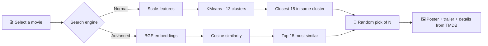

<div align="center">


# 🎬 Movie Magic AI

### Intelligent movie discovery powered by Machine Learning, Semantic Embeddings and Live TMDB Data

<p>
  
  
  
  
  
  
</p>

<p>
  <a href="#-features">Features</a> •
  <a href="#-how-it-works">How It Works</a> •
  <a href="#-tech-stack">Tech Stack</a> •
  <a href="#-getting-started">Getting Started</a> •
  <a href="#-usage">Usage</a> •
  <a href="#-configuration">Configuration</a> •
  <a href="#-author">Author</a>
</p>

</div>

---

<!-- Add a screenshot or GIF of the app here, for example:
<div align="center">
  
</div>
-->

## 📌 Overview

**Movie Magic AI** is a Streamlit dashboard that recommends movies using two complementary approaches: classic **KMeans clustering** on movie attributes and modern **semantic text embeddings** on plot descriptions. Every recommendation is displayed as a rich card with metadata, a poster and an embedded trailer pulled live from **The Movie Database (TMDB)**.

---

## ✨ Features

<table>
  <tr>
    <td width="33%" valign="top">
      <h3>🧩 Two Engines</h3>
      <p><b>Normal Search</b> uses KMeans clustering. <b>Advanced Search</b> uses semantic similarity between plot descriptions.</p>
    </td>
    <td width="33%" valign="top">
      <h3>🎲 Varied Results</h3>
      <p>Picks are drawn randomly from a pool of the closest matches, so each click gives fresh suggestions that stay highly relevant.</p>
    </td>
    <td width="33%" valign="top">
      <h3>📊 Data Exploration</h3>
      <p>Compare any movie with its genre average, view rating distributions and statistics, and check nulls and duplicates.</p>
    </td>
  </tr>
  <tr>
    <td width="33%" valign="top">
      <h3>🖼️ Rich Cards</h3>
      <p>Metadata, poster and trailer for every recommendation, retrieved in real time from the TMDB API.</p>
    </td>
    <td width="33%" valign="top">
      <h3>⚡ Fast After First Run</h3>
      <p>Embeddings, clustering and API calls are cached, so the app stays responsive after the initial load.</p>
    </td>
    <td width="33%" valign="top">
      <h3>🎨 Polished UI</h3>
      <p>Animated About page with custom SVG icons, gradient cards and a responsive layout.</p>
    </td>
  </tr>
</table>

---

## 🧠 How It Works



<table>
  <thead>
    <tr>
      <th align="left">Engine</th>
      <th align="left">Input</th>
      <th align="left">Method</th>
      <th align="left">Output</th>
    </tr>
  </thead>
  <tbody>
    <tr>
      <td><b>🔵 Normal Search</b></td>
      <td>Genre (one-hot), director and cast frequency, year, runtime, rating, votes</td>
      <td>Features are standardized and grouped into <b>13 clusters</b> with KMeans. Movies in the selected title's cluster are ranked by distance in feature space.</td>
      <td>Random picks from the 15 closest movies in the cluster</td>
    </tr>
    <tr>
      <td><b>🟣 Advanced Search</b></td>
      <td>Plot descriptions</td>
      <td>Each description becomes a <b>384-dimension vector</b> via <code>BAAI/bge-small-en-v1.5</code>. Cosine similarity ranks all other movies.</td>
      <td>Random picks from the 15 most similar movies</td>
    </tr>
  </tbody>
</table>

> Both engines exclude the selected movie and remove duplicate titles.

---

## 🛠️ Tech Stack

<table>
  <tr>
    <td><b>🌐 Web App</b></td>
    <td>Streamlit, custom HTML / CSS / SVG</td>
  </tr>
  <tr>
    <td><b>📦 Data</b></td>
    <td>pandas, NumPy</td>
  </tr>
  <tr>
    <td><b>🤖 Machine Learning</b></td>
    <td>scikit-learn (StandardScaler, KMeans, cosine similarity)</td>
  </tr>
  <tr>
    <td><b>💬 NLP</b></td>
    <td>Hugging Face Transformers, PyTorch, <code>BAAI/bge-small-en-v1.5</code></td>
  </tr>
  <tr>
    <td><b>📈 Visualization</b></td>
    <td>Matplotlib, Seaborn</td>
  </tr>
  <tr>
    <td><b>🔌 External API</b></td>
    <td>The Movie Database (TMDB)</td>
  </tr>
</table>

---

## 📁 Project Structure

```text
Movie-Recommendation-Dashboard-/
├── 📂 data/
│   └── imdb_movie_dataset.csv   # Movie dataset
├── 📂 script/
│   ├── p.py                     # Streamlit app: pages, UI, Normal Search
│   ├── advanced.py              # Embedding model and Advanced Search
│   └── api.py                   # TMDB helpers: movie data, trailers, poster URL
├── requirements.txt
└── README.md
```

---

## 🚀 Getting Started

### Prerequisites

- Python **3.10+** (3.12 recommended, since PyTorch builds are most reliable there)
- A free [TMDB API key](https://www.themoviedb.org/settings/api)

### Installation

**1️⃣ Clone the repository**

```bash
git clone https://github.com/Bilall2003/Movie-Recommendation-Dashboard-.git
cd Movie-Recommendation-Dashboard-
```

**2️⃣ Create a virtual environment**

```bash
python -m venv venv
source venv/bin/activate        # Windows: venv\Scripts\activate
```

**3️⃣ Install dependencies**

```bash
pip install streamlit pandas numpy scikit-learn seaborn matplotlib requests transformers
pip install torch --index-url https://download.pytorch.org/whl/cpu
```

Or, if you have a `requirements.txt`:

```bash
pip install -r requirements.txt
```

**4️⃣ Add your TMDB API key**

Provide the key the way `api.py` reads it, for example as an environment variable:

```bash
export TMDB_API_KEY="your_api_key_here"
```

> ⚠️ Never commit your API key to GitHub.

**5️⃣ Run the app** from the project root so the dataset path resolves:

```bash
python -m streamlit run script/p.py
```

Open the local URL shown in the terminal, usually <kbd>http://localhost:8501</kbd>.

> 💡 The first **Advanced Search** click is slower because the model downloads and every description is embedded. Results are cached, so later clicks are fast.

---

## 📖 Usage

<table>
  <tr>
    <td align="center" width="33%">
      <h3>📟 About</h3>
      <p>Overview of the project and both recommendation engines.</p>
    </td>
    <td align="center" width="33%">
      <h3>📊 Data Exploration</h3>
      <p>Pick a movie, compare it with its genre and validate data quality.</p>
    </td>
    <td align="center" width="33%">
      <h3>🎬 Recommender</h3>
      <p>Choose a movie and engine, then click <b>Generate Recommendations</b>.</p>
    </td>
  </tr>
</table>

1. Select a movie you like and the number of recommendations (1 to 5).
2. Choose **Normal Search** or **Advanced Search** in the sidebar.
3. Click **Generate Recommendations 🚀**. Click again for a fresh set of similar movies.

---

## ⚙️ Configuration

| Setting | Where | Default | Effect |
|---------|-------|:-------:|--------|
| `pool_size` (Normal) | `kmeans_recs()` in `p.py` | `15` | Smaller = closer matches, larger = more variety |
| `pool_size` (Advanced) | `emb_pipeline()` in `advanced.py` | `15` | Same trade-off |
| `n_clusters` | `compute_clusters()` in `p.py` | `13` | Number of KMeans clusters |
| Embedding model | `load_embedding_model()` in `advanced.py` | `BAAI/bge-small-en-v1.5` | Swap for another feature-extraction model |

---

## 🩺 Troubleshooting

<details>
<summary><b>❌ NameError: name 'torch' is not defined</b></summary>
<br>
PyTorch is missing, or Streamlit is using a different Python. Install torch in your venv and start the app with <code>python -m streamlit run script/p.py</code>.
</details>

<details>
<summary><b>📂 Dataset not found</b></summary>
<br>
Run the app from the project root and confirm <code>data/imdb_movie_dataset.csv</code> exists.
</details>

<details>
<summary><b>🖼️ No posters or trailers</b></summary>
<br>
Check that your TMDB API key is set and valid.
</details>

<details>
<summary><b>🐢 Slow first recommendation</b></summary>
<br>
Expected. The model downloads and embeddings are built once, then cached.
</details>

---

## 🔭 Future Improvements

- [ ] Hybrid ranking that blends cluster distance with embedding similarity
- [ ] User ratings and personalized recommendations
- [ ] Saved watchlists
- [ ] Persist embeddings to disk for faster cold starts
- [ ] Hosted vector database for larger catalogs

---

## 👤 Author

<div align="center">

**Bilal Ahmed**

<a href="https://github.com/Bilall2003">
  
</a>

</div>

---

## 🙏 Acknowledgements

- [The Movie Database (TMDB)](https://www.themoviedb.org/) for posters, trailers and metadata
- [BAAI](https://huggingface.co/BAAI/bge-small-en-v1.5) for the BGE embedding model
- [Streamlit](https://streamlit.io/), [scikit-learn](https://scikit-learn.org/) and [Hugging Face Transformers](https://huggingface.co/docs/transformers)

<div align="center">
  <sub>This product uses the TMDB API but is not endorsed or certified by TMDB.</sub>
  <br><br>
  ⭐ If you found this project useful, consider giving it a star!
</div>
